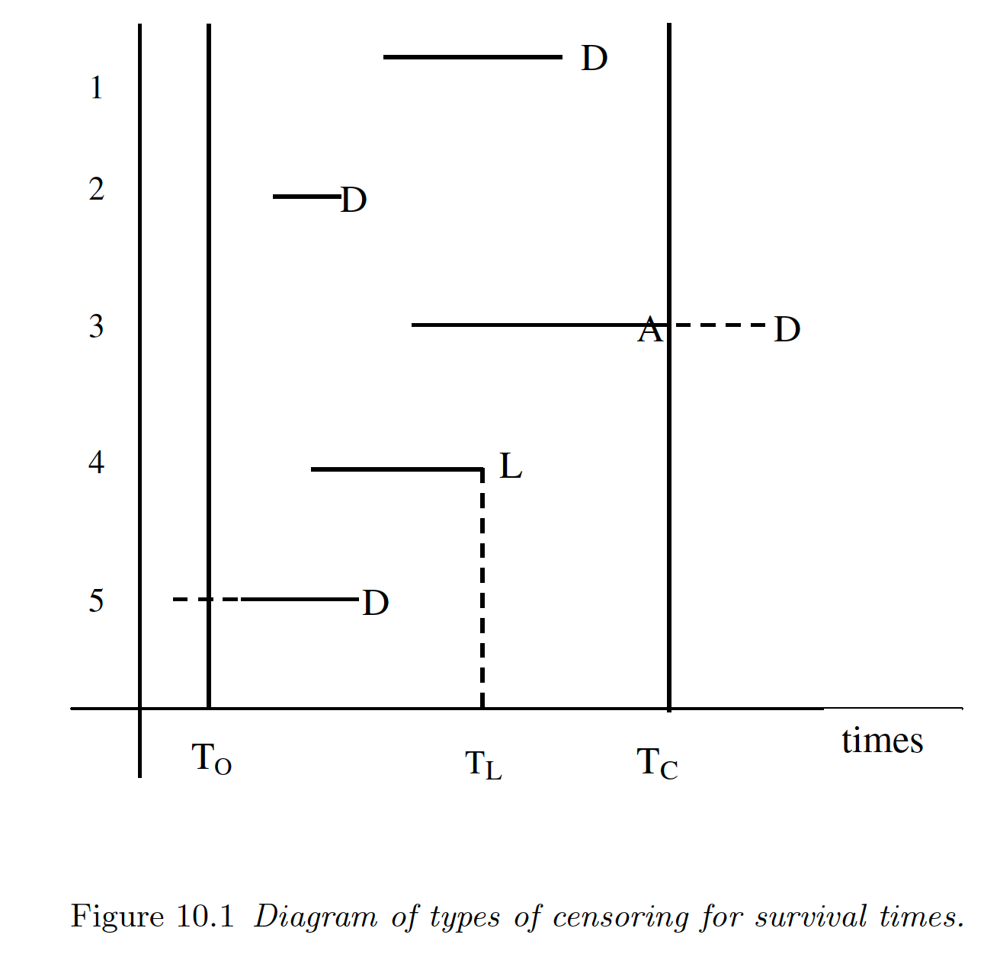

```{r setup, include=FALSE}
knitr::opts_chunk$set(fig.align = 'center', cache = FALSE)
```

Display system information and load `tidyverse`.
```{r}
sessionInfo()
library(tidyverse)
```
```{r, include=FALSE}
knitr::opts_chunk$set(fig.align = 'center', cache = FALSE)
```

This lecture notes draw heavily on the Chapter 10 of textbook _An Introduction to Generalized Linear Models_ by Dobson and Barnett (2nd or 3rd edition). [ULCA library link to the 2nd edition](https://ucla.on.worldcat.org/oclc/317751780).

## Introduction

- Survival model studies the time from a well-defined starting point until some event, called "failure", occurs. In other words, survial models studies **time-to-event**.

- Survival outcomes, or **survival times**, have at least two important features:

    1. the times are non-negative and typically have skewed distributions with long tails.  
    
    2. **censoring**: some subjects may survive beyond the study period so their actual failure times are unknown. 
    
- In following diagram, subject 3 is **right-censored**, subject 4 is **right-censored** due to loss to follow up, and subject 5 is **left-censored**. 

<p align="center">
  
</p>

## Survivor functions and hazard functions

- Let $Y=$ survival time, and $f(y)$ be its density. The probability of failure before a specific time $y$ is given by the cummulative distribution function (cdf)
$$
F(y) = \mathbb{P}(Y < y) = \int_0^y f(t) \, dt. 
$$

- The **survivor function** is the probability of survival beyond time $y$
$$
S(y) = \mathbb{P}(Y \ge y) = 1 - F(y).
$$

- The **hazard function** is the probability of death in an infinitesimal small interval $[y, y + \delta y]$, given surivival up to time $y$
\begin{eqnarray*}
h(y) &=& \lim_{\delta y \to 0} \frac{\mathbb{P}(y \le Y \le y + \delta y \mid Y > y)}{\delta y} \\
&=& \lim_{\delta y \to 0} \frac{F(y + \delta y) - F(y)}{\delta y} \times \frac{1}{S(y)} \\
&=& \frac{f(y)}{S(y)}.
\end{eqnarray*}

- Rewrite the hazard function as
$$
h(y) = - \frac{\operatorname{d}}{\operatorname{d} y} \log S(y).
$$
Then we have
$$
S(y) = e^{-H(y)} = e^{- \int_0^y h(t) \, dt}
$$
or
$$
H(y) = - \log S(y).
$$
$H(y)$ is called the **cumulative hazard function** or the **integrated hazard function**. 

- The **median survival time**, $y(50)$, is given by the solution of $F(y) = 1/2$.

### Exponential distribution

- A simple model for $Y$ is the exponential distribution with density
$$
f(y; \theta) = \theta e^{-\theta y}, \quad y \ge 0, \theta > 0
$$
and moments $\mathbb{E}Y = \theta^{-1}$, $\operatorname{Var} Y = \theta^{-2}$.

- The cdf of exponential is
$$
F(y; \theta) = \int_0^y \theta e^{-\theta t} \, dt = 1 - e^{-\theta y}.
$$

- The survivor function is
$$
S(y,; \theta) = e^{-\theta y}.
$$

- The hazard function is
$$
h(y; \theta) = \frac{f(y; \theta)}{S(y; \theta)} = \theta.
$$
The hazard function does not depent on $y$. This **lack of memory** property may be a limitation because in many applications the probability of failure often increases with time.

- The cumulative hazard function is
$$
H(y; \theta) = \theta y.
$$

### Proportional hazards model

- For the exponential distribution, to ensure $\theta>0$, it is common to use the log link
$$
\theta = e^{\mathbf{x}^T \boldsymbol{\beta}}.
$$
Then the hazard function has the multiplicative form
$$
h(y; \boldsymbol{\beta}) = \theta = e^{\mathbf{x}^T \boldsymbol{\beta}}.
$$
A unit change in $x_k$ will result in a **hazard ratio** or **relative hazard**
$$
\frac{h_1(y; \boldsymbol{\beta})}{h_0(y; \boldsymbol{\beta})} = e^{\beta_k}.
$$

- Any model of the form
$$
h_1(y) = h_0(y) e^{\mathbf{x}^T \boldsymbol{\beta}}
$$
is called a **proportional hazards model**. $h_0(y)$, which is hazard function corresponding to the reference levels for all the explanatory variables, is called the **baseline hazard**. 

- For proportional hazards models, the cumulative hazard function is given by
$$
H_1(y) = \int_0^y h_1(t) \, dt = \int_0^y h_0(t) e^{\mathbf{x}^T \boldsymbol{\beta}} \, dt = H_0(y) e^{\mathbf{x}^T \boldsymbol{\beta}},
$$
so
$$
\log H_1(y) = \log H_0(y) + \mathbf{x}^T \boldsymbol{\beta}.
$$

### Weibull distribution

- Another commonly used model for survival times is the Weibull distribution with density
$$
f(y; \lambda, \theta) = \frac{\lambda y^{\lambda - 1}}{\theta^\lambda} e^{-(y / \theta)^\lambda}, \quad y \ge 0, \lambda > 0, \theta > 0,
$$
where $\lambda$ and $\theta$ are shape and scale parameters respectively. 

```{r}
y <- seq(0, 2.5, by = 0.01)
lambda <- 5 # shape
theta <- 1 # scale
tibble(y = y,
       f = dweibull(y, lambda, theta)) %>%
  ggplot() + 
  geom_line(mapping = aes(x = y, y = f)) + 
  labs(x = "y", y = "f(y)", title = "Weibull density")
```

- With reparameterization $\theta^{-\lambda} = \phi$, the density is
$$
f(y; \lambda, \phi) = \lambda \phi y^{\lambda - 1} e^{-\phi y^{\lambda}}.
$$
Exponential distribution is a special case of Weibull with $\lambda = 1$.

- The survivor function for Weibull is
$$
S(y; \lambda, \phi) = \int_y^\infty \lambda \phi u^{\lambda - 1} e^{-\phi u^{\lambda}} \, du = e^{-\phi y^{\lambda}}.
$$

- The hazard function is
$$
h(y; \lambda, \phi) = \frac{f(y; \lambda, \phi)}{S(y; \lambda, \phi)} = \lambda \phi y^{\lambda - 1}.
$$
The hazard function depends on $y$ and yields **accelerated failure time** models.

- The cumulative hazard function is 
$$
H(y; \lambda, \phi) = \phi y^{\lambda}.
$$

- The mean of Weibull is
$$
\mathbb{E} Y = \int_0^\infty \lambda \phi y^{\lambda} e^{-\phi y^\lambda} \, dy = \phi^{-1/\lambda} \Gamma(1 + 1/\lambda).
$$
The median of Weibull is
$$
y(50) = \phi^{-1/\lambda} (\log 2)^{1/\lambda}.
$$

- We model relationship between $Y$ and predictors in terms of $\phi$
$$
\phi = \alpha e^{\mathbf{x}^T \boldsymbol{\beta}}.
$$
Then the hazard function is
$$
h(y; \lambda, \phi) = \lambda \alpha y^{\lambda - 1} e^{\mathbf{x}^T \boldsymbol{\beta}}.
$$
If $h_0(y)$ is the baseline hazard function corresponding to reference levels of all predictors, then
$$
h(y) = h_0(y) e^{\mathbf{x}^T \boldsymbol{\beta}},
$$
which is a proportional hazards model.

## Kaplan-Meier estimate 

- The empirical survivor function, an estimate of the probability of survival beyond time $y$, is
$$
\widehat{S}(y) = \widehat{\mathbb{P}}(Y \ge y).
$$
- Arrange the even times $y_{(1)} \le y_{(2)} \le \cdots \le y_{(k)}$.  **Kaplan-Meier formula** or **product limit formula**
\begin{eqnarray*}
\widehat{S}(y_{k}) &=& \widehat{\mathbb{P}}(Y \ge y_{(k)}) \\
&=& \widehat{\mathbb{P}}(Y \ge y_{(k-1)}) \times \widehat{\mathbb{P}}(Y > y_{(k)} \mid Y \ge y_{(k-1)}) \\
&=& \widehat{S}(y_{k-1}) \times \widehat{\mathbb{P}}(Y > y_{(k)} \mid Y \ge y_{(k-1)}) \\
&=& \cdots \\
&=& \prod_{j=1}^k \widehat{\mathbb{P}}(Y > y_{(j)} \mid Y \ge y_{(j-1)}) \\
&=& \prod_{j=1}^k \left( \frac{n_j - d_j}{n_j} \right),
\end{eqnarray*}
where
\begin{eqnarray*}
n_j &=& \text{number of subjects who are alive just before time $y_{(j)}$}, \\
d_j &=& \text{number of deaths that occur at time $y_{(j)}$}.
\end{eqnarray*}

- The leukemia data `gehan`. `time` is the remission time in weeks.
```{r}
library(MASS)
library(ggfortify)

gehan <- as_tibble(gehan) %>%
  mutate(treat = relevel(treat, ref = "control")) %>%
  print(n = Inf)
```

- Numerical summary:
```{r}
summary(gehan)
```

- Graphical summary:
```{r}
gehan %>%
  #filter(treat == "control") %>%
  ggplot() + 
  geom_dotplot(mapping = aes(x = time, fill = factor(cens)), binwidth = 1) + 
  facet_wrap(~ treat)
```

```{r}
library(survival)

kmfit <- survfit(Surv(time, cens) ~ treat, data = gehan)
summary(kmfit)
autoplot(kmfit)
```

- **Exercise**: Manually calculate the Kaplan-Meier estimator for the treatment and control groups.

## Estimation

- A datum of a survival data set is $(y_j, \delta_j, \mathbf{x}_j)$ where  
    - $y_j$ is the survival time,  
    - $\delta_j$ is the censoring indicator with $\delta_j = 1$ if the survival time is uncensored and $\delta_j=0$ if it is censored, and  
    - $\mathbf{x}_j$ is the predictor vector. 
    
- Let $y_1, \ldots, y_r$ be the uncensored observations and $y_{r+1}, \ldots, y_n$ the censored ones. The likelihood is 
$$
L = \prod_{j=1}^r f(y_j) \times \prod_{j=r+1}^n S(y_j) = \prod_{j=1}^n f(y_j)^{\delta_j} S(y_j)^{1 - \delta_j}
$$
so the log-likelihood is
$$
\ell = \sum_{i=1}^n [\delta_j \log f(y_j) + (1 - \delta_j) \log S(y_j)] = \sum_{j=1}^n [\delta_j \log h(y_j) + \log S(y_j)].
$$

- Esimtation by MLE.

### Exponential model

- The log-likelihood for the exponential model is
$$
\ell(\boldsymbol{\theta}) = \sum_j [\delta_j \log h(y_j) + \log S(y_j)] = \sum_j (\delta_j \log \theta_j - \theta_j y_j).
$$
The right hand side resembles the log-likelihood if treating $\delta_j$ as Poisson$(\mu_j)$ where $\mu_j = \theta_j y_j$. If we use the log link, then
$$
\log \mu_j = \log \theta_j + \log y_j.
$$
So the survival times $y_j$ are included in the model as an offset term $\log y_j$.

- Proportional hazards model is modeled with $\theta = e^{\mathbf{x}^T \boldsymbol{\beta}}$. We have
$$
\ell(\boldsymbol{\beta}) = \sum_j (\delta_j \cdot \mathbf{x}^T \boldsymbol{\beta} - y_j e^{\mathbf{x}^T \boldsymbol{\beta}}).
$$

```{r}
glm(cens ~ treat + offset(log(time)), family = poisson, data = gehan) %>%
  summary()
```


- Check against the standard software in `survival` package. The coefficients have opposite sign because `survreg` links to the mean of exponential which is $\theta^{-1}$.
```{r}
emod <- survreg(Surv(time, cens) ~ treat, dist = "exponential", data = gehan)
summary(emod)
```

### Weibull model

- With link function $\phi = \alpha e^{\mathbf{x}^T \boldsymbol{\beta}}$, the log-likelihood of Weibull model is
$$
\ell(\boldsymbol{\beta}) = \sum_j [\delta_j \log h(y_j) + \log S(y_j)]  = \sum_{j=1}^n [\delta_j \log (\lambda \alpha y_j^{\lambda - 1} e^{\mathbf{x}^T \boldsymbol{\beta}}) - \alpha y_j^{\lambda} e^{\mathbf{x}^T \boldsymbol{\beta}}].
$$
Again this is almost the log-likelihood if we pretend $\delta_j$ are independent Poisson$(\mu_j)$ where $\mu_j = \alpha y_j^{\lambda} e^{\mathbf{x}^T \boldsymbol{\beta}}$. 

- The log link gives
$$
\log \mu_j = \log \alpha + \lambda \log y_j + \mathbf{x}_j^T \boldsymbol{\beta}.
$$
Therefore we should include offset term $\lambda \log y_j$ in the Poisson regression. 

- Setting the derivative wrt $\lambda$ to 0
$$
\frac{\partial \ell}{\partial \lambda} = \sum_{j=1}^n \frac{\delta_j}{\lambda} + \delta_j \log y_j - (\log y_j) (\alpha y_j^{\lambda} e^{\mathbf{x}^T \boldsymbol{\beta}}) = 0
$$
yields the estimation equation
$$
\widehat{\lambda} = \frac{\sum_j \delta_j}{\sum_{j=1}^n (\mu_j - \delta_j) \log y_j}.
$$
This suggests an estimation procedure that alternately updates $\lambda$ by above equation and then updates $\boldsymbol{\beta}$ by a Poisson regression with offset $\lambda \log (y_i)$. The damping update recommended by Aitkin and Clayton (1980) improves the convergence
$$
\lambda^{(k)} = \frac{\lambda^{(k-1)} + \widehat{\lambda}}{2}.
$$

- Let's manually implement the estimation procedure, starting from the exponential model with $\lambda = 1$.
```{r}
sumdelta <- sum(gehan$cens)
lambda <- 1
for (iter in 1:10) {
  pmod <- glm(cens ~ treat + offset(lambda * log(time)), family = poisson, data = gehan)
  cat(iter, "lambda=", lambda, "\t", "beta(treatment)=", coef(pmod)[2], "\n")
  mu <- predict(pmod, type = "response")
  lambda_new <- sumdelta / sum((mu - gehan$cens) * log(gehan$time))
  lambda = (lambda + lambda_new) / 2
}
summary(pmod)
```

- Now let's check using the standard software in `survival` package. It's using a different parameterization from ours. 
```{r}
wmod <- survreg(Surv(time, cens) ~ treat, dist = "weibull", data = gehan)
summary(wmod)
```

## Model checking

### Check probability model

- For exponential model,
$$
S(y; \theta) = e^{-\theta y}.
$$
So plot of $- \log[\widehat{S}(y)]$ against y should be approximately linear. 

```{r}
str(kmfit)
```

```{r}
tibble(surv = kmfit$surv,
        time = kmfit$time) %>%
  ggplot() + 
  geom_point(mapping = aes(x = time, y = - log(surv))) + 
  labs(x = "Event time", y = "-log(Surv. Prob.)")
```

```{r, echo=F, eval = F}
tibble(surv = predict(emod, type="quantile"))
```

- For Weibull model,
$$
S(y; \lambda, \phi) = e^{-\phi y^\lambda}.
$$
So we expect the plot of $\log [- \log \widehat{S}(y)]$ against $\log y$ to be linear.
```{r}
tibble(surv = kmfit$surv,
       time = kmfit$time) %>%
  ggplot() + 
  geom_point(mapping = aes(x = log(time), y = log(- log(surv)))) + 
  labs(x = "log(Event Time)", y = "log[-log(Surv. Prob.)]")
```

### Check proportional hazard assumption

- For proportional hazards model
$$
h(y) = h_0(y) e^{\mathbf{x}^T \boldsymbol{\beta}}.
$$
Consider a binary predictor $x_k \in \{0,1\}$, then
$$
\log H_1 = \log H_0 + \beta_k.
$$
So the $\log [- \log \widehat{S}(y)]$ against $\log y$ plot stratified according to $x_k$ should be parallel with distance $\beta_k$.

### Residual plots

- Cox-Snell residuals. For uncensored survival time of subject $j$,
$$
r_{C_j} = \widehat{H}_j(Y_j) = - \log [\widehat{S}_j(y_j)].
$$
For censored observations, $r'_{C_j} = r_{C_j} + \Delta$, where $\Delta = 1$ or $\log 2$. Distribution of $r'_{C_j}$ is compared to exponential with unit mean. 

- Martingale residuals
$$
r_{M_j} = \delta_j - r_{C_j}.
$$
These residuals have expected value of 0 but a negatively skewed distribution.

- Deviance residuals.
$$
r_{D_j} = \text{sign}(r_{M_j}) \{ -2[r_{M_j} + \delta_j \log (r_{C_j})] \}^{1/2}.
$$
Deviance residuals are approximately symmetrically distributed about 0.
